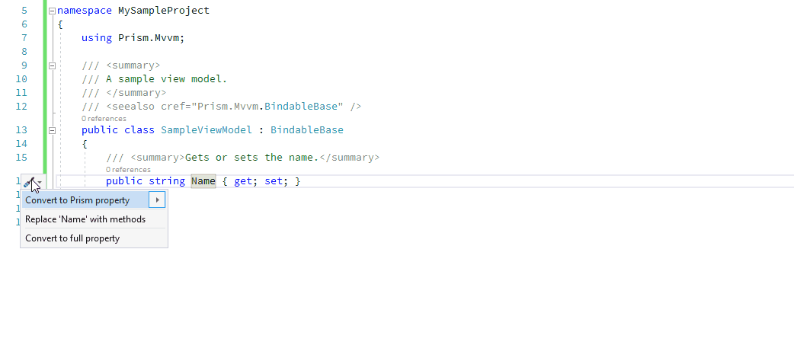

# DD.PrismRefactorings

This Visual Studio extension provides a code fix to transform an auto-property of a view model to a property with a backing field whose setter uses Prism's BindableBase.SetProperty pattern.
